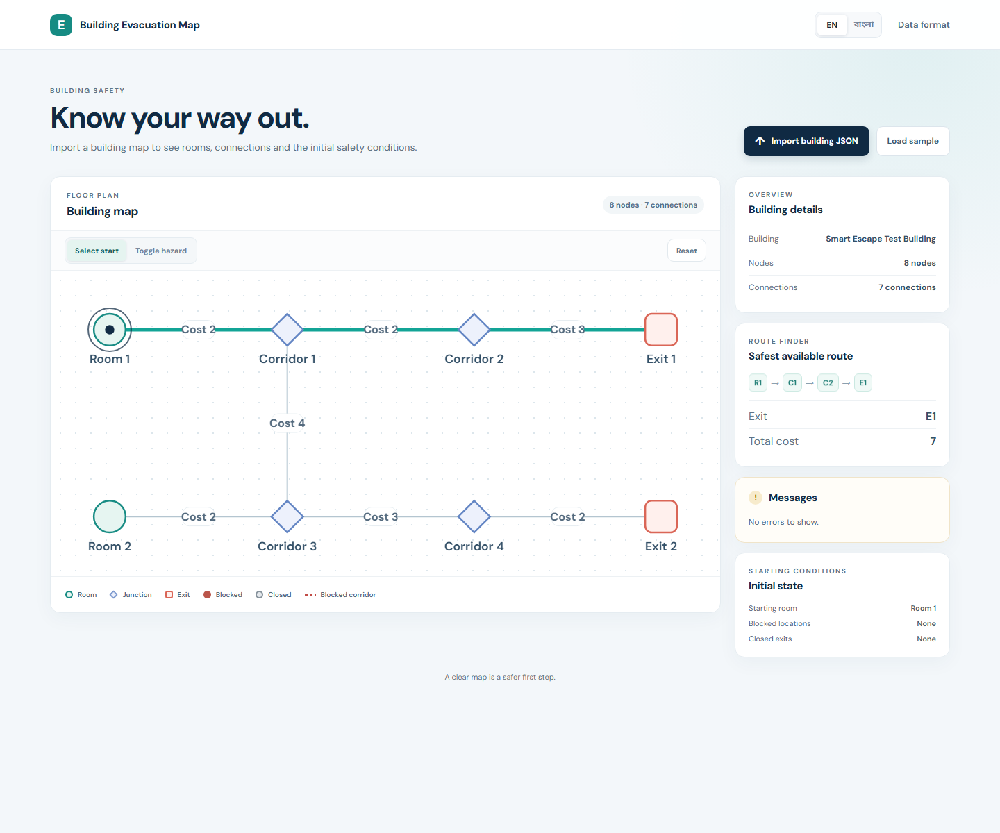
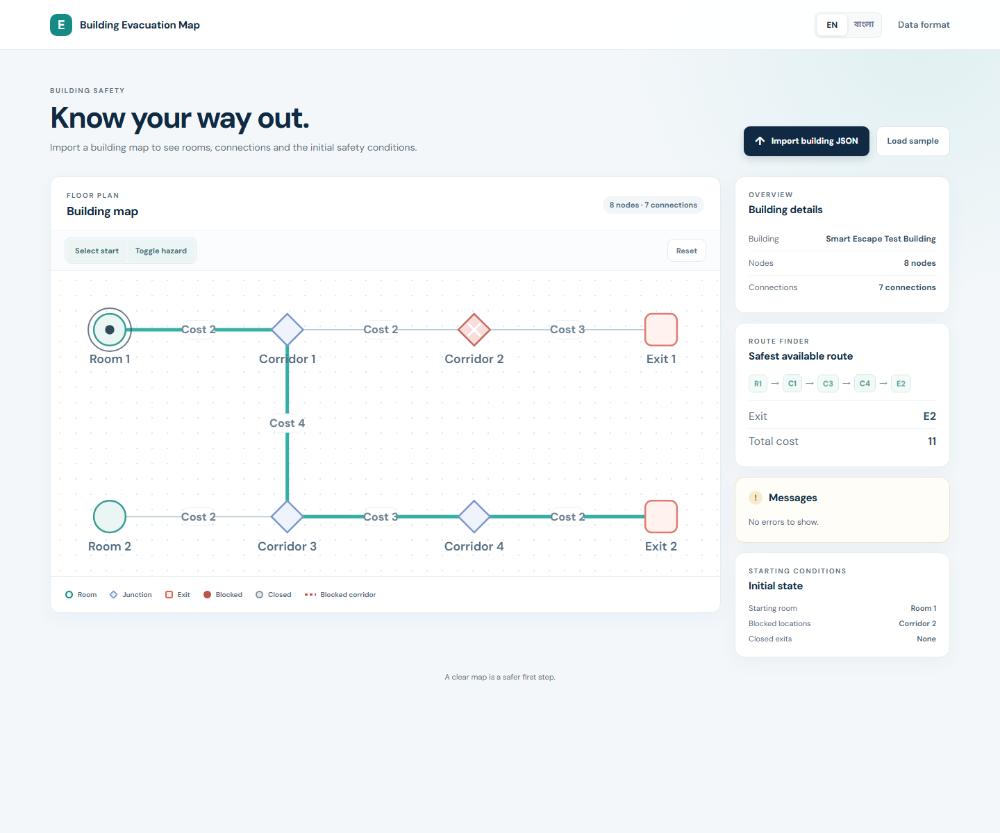

# Smart Escape: Interactive Evacuation Route Simulator

**Name:** Ratul Hasan

**Registration number:** not issued for the mock test

**Live HTTPS site:** [https://ratulhasan02.github.io/devfest-smart-escape/](https://ratulhasan02.github.io/devfest-smart-escape/)
**Repository:** [github.com/Ratulhasan02/devfest](https://github.com/Ratulhasan02/devfest)

A bilingual, static evacuation planner built with plain HTML, CSS, and JavaScript ES modules. It validates imported building maps, finds deterministic shortest routes, and lets occupants model blocked rooms, corridors, and exits.

## Features

- Switch between English and Bengali; the choice is saved in local storage.
- Import a building JSON file or load the included sample.
- Validate node/edge limits, IDs, categories, coordinates, costs, connections, and initial hazards before drawing a map.
- View a responsive SVG floor plan with distinct room, junction, and exit shapes.
- Select an unblocked room or junction as the start and calculate a minimum-cost route to an open exit.
- Resolve ties deterministically by total cost, exit ID, and the full node-ID path (case-sensitive string order).
- Toggle node, corridor, and exit hazards in a separate interaction mode. Routes update immediately.
- Reset hazards to the imported initial state while preserving a still-valid selected start.
- Use the app with keyboard-operable controls and reduced-motion preferences.

## Bonus features

No optional bonus features from the challenge list are implemented. The app does include accessible SVG node and corridor controls, in addition to the required map interactions.

## Run locally

The sample loader and ES modules need an HTTP origin. From this folder, start any static web server and open its local URL. For example:

```powershell
npx serve .
```

The site is deployed with GitHub Pages from the `main` branch root. After pushing a change, check the repository's Pages deployment action and allow a short time for the live site to update.

## Screenshots

Baseline route from R1:



Reroute after blocking C2:



## Sample route checks

The included test building supports the five challenge checks:

1. Start at R1: `R1 → C1 → C2 → E1`, cost 7.
2. Block C2: `R1 → C1 → C3 → C4 → E2`, cost 11.
3. Close E1 and E2: no route available.
4. Start at R2: `R2 → C3 → C4 → E2`, cost 7.
5. Start at R1, then block R1: starting location blocked.

## Building JSON format

```json
{
  "name": "Example Building",
  "nodes": [
    { "id": "lobby", "label": "Lobby", "type": "room", "x": 120, "y": 180 },
    { "id": "hall", "label": "Hall", "type": "junction", "x": 300, "y": 180 },
    { "id": "exit-a", "label": "East Exit", "type": "exit", "x": 500, "y": 180 }
  ],
  "edges": [
    { "from": "lobby", "to": "hall", "cost": 2 },
    { "from": "hall", "to": "exit-a", "cost": 3 }
  ],
  "initial_state": {
    "start": "lobby",
    "blocked_nodes": [],
    "closed_exits": []
  }
}
```

- `name` must be a non-empty string.
- Include 2–60 nodes and 1–150 connections. Node IDs must be unique.
- Node `type` is `room`, `junction` or `exit`; `x` and `y` are finite numbers. `label` is optional and defaults to the node ID.
- Every connection has existing `from` and `to` IDs and a positive integer `cost`. Self-connections and duplicate undirected pairs are not allowed.
- Include at least one room or junction and at least one exit.
- `initial_state.start` must identify a room. `blocked_nodes` can contain rooms and junctions; `closed_exits` can contain exits. Each list must be an array of existing node IDs.

Validation errors are listed beside the map in the selected language. Invalid data is never drawn.

## Select a start and test hazards

Use **Select start** and click an unblocked room or junction to recalculate its shortest route to an open exit. **Toggle hazard** switches clicks to toggling blocked rooms/junctions, blocked corridors, and closed exits. The Reset button restores the imported file's original hazards and keeps the selected starting node when it remains valid.

The included sample uses the R1/R2 and C1–C4 test graph. From R1 the route to E1 costs 7; blocking C2 reroutes to E2 for 11. From R2 the route to E2 costs 7.

## Known issues and scope

- Route costs are abstract edge weights; the app does not estimate travel time, accessibility, or real-world building safety.
- Uploaded maps and hazard changes are kept only in the current page session. Only the language preference is saved in local storage.
- The map is a coordinate-based floor-plan diagram, not a scale-accurate architectural drawing.
- The challenge sample is synthetic and should not be used for emergency response.

## AI tools and useful prompt

**AI tools used:** GitHub Copilot in VS Code for implementation assistance, code review, and test-case generation. The routing and validation behavior was checked against the challenge's concrete examples.

**Most useful prompt:** “Implement the Smart Escape routing engine as a pure Dijkstra function with exact, case-sensitive tie-breaking by minimum cost, exit ID, then the full node-ID sequence. Add selectable starts, node/corridor/exit hazard toggles, reset to imported initial state, bilingual failure messages, and verify the five supplied route scenarios.”

## Project files

- `index.html` — app layout and accessible controls.
- `css/style.css` — responsive styling and SVG map styles.
- `js/i18n.js` — English/Bengali translations and saved language choice.
- `js/validate.js` — JSON shape and domain validation.
- `js/graph.js` — pure shortest-route calculation and deterministic tie-breaking.
- `js/state.js` — starting location, current hazards and reset behavior.
- `js/render.js` — interactive SVG map and information panels.
- `js/main.js` — import, routing, hazard controls and event wiring.
- `sample/building.json` — example building.
